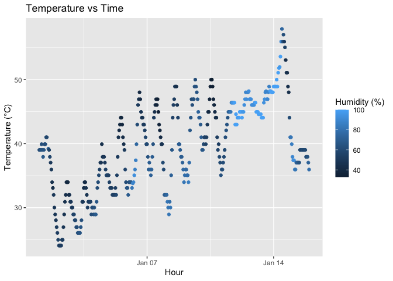

p8105_hw1_kjw2175
================
Kennedy Wade
2025-09-19

## Problem 0.1 / 0.2

This homework is organized in a public GitHub repo with a local R
Project. The repo includes this .Rmd file, the knitted markdown
document, and the exported plot. My commit history shows the steps I
used to complete the assignment.

## Problem 1

This “problem” focuses on correct styling for your solutions to Problems
1 and 2.

``` r
 # load packages
library(moderndive)
library(dplyr)
```

    ## 
    ## Attaching package: 'dplyr'

    ## The following objects are masked from 'package:stats':
    ## 
    ##     filter, lag

    ## The following objects are masked from 'package:base':
    ## 
    ##     intersect, setdiff, setequal, union

``` r
library(ggplot2)

# load the dataset
data("early_january_weather")

#mean temperature
mean_temp = mean(pull(early_january_weather, temp))

# scatterplot: temp vs time_hour, colored by humidity
ggplot(early_january_weather, aes(x = time_hour, y = temp, color = humid)) +
  geom_point() +
  labs(
    title = "Temperature vs Time ",
    x = "Hour",
    y = "Temperature (°C)",
    color = "Humidity (%)"
  ) 
```

<!-- -->

``` r
# export plot
ggsave("weather_scatterplot.png")
```

    ## Saving 7 x 5 in image

The `early_january_weather` dataset has 358 rows and 15 columns.The
variables names (columns) included are origin, year, month, day, hour,
temp, dewp, humid, wind_direction, wind_speed, wind_gust,precipitation,
pressure, visb, and time_hour. The mean temperature during this period
was 39.58 °C.The weather scatter plot shows that temperatures are
generally lower in the early morning hours, rise throughout the day, and
peak in the afternoon. Humidity tends to be higher when temperatures are
higher and decreases slightly as temperatures decrease. The points are
fairly evenly spread, and the color gradient effectively highlights
changes in humidity throughout the day.

## Problem 2

This problem is intended to emphasize variable types and introduce
coercion; some awareness of how R treats numeric, character, and factor
variables is necessary for working with these data types in practice.

Let’s create a dataframe.

``` r
library(tidyverse)  
```

    ## ── Attaching core tidyverse packages ──────────────────────── tidyverse 2.0.0 ──
    ## ✔ forcats   1.0.0     ✔ stringr   1.5.1
    ## ✔ lubridate 1.9.4     ✔ tibble    3.3.0
    ## ✔ purrr     1.1.0     ✔ tidyr     1.3.1
    ## ✔ readr     2.1.5     
    ## ── Conflicts ────────────────────────────────────────── tidyverse_conflicts() ──
    ## ✖ dplyr::filter() masks stats::filter()
    ## ✖ dplyr::lag()    masks stats::lag()
    ## ℹ Use the conflicted package (<http://conflicted.r-lib.org/>) to force all conflicts to become errors

``` r
hw1_df <- tibble(
  vec_numeric = rnorm(10),                     
  vec_logical = vec_numeric > 0,                  
  vec_char = letters[1:10],                       
  vec_factor = factor(rep(c("1", "2", "3"), length.out = 10)) 
)
```

Now, convert variables to numeric using `as.numeric`

``` r
#Trying to take the mean of each variable using pull
mean(pull(hw1_df, vec_numeric))
```

    ## [1] -0.3093599

``` r
mean(pull(hw1_df, vec_logical))
```

    ## [1] 0.5

``` r
# Convert variables to numeric
as_numeric_logical <- as.numeric(pull(hw1_df, vec_logical)) 
as_numeric_char <- as.numeric(pull(hw1_df, vec_char))   
```

    ## Warning: NAs introduced by coercion

``` r
as_numeric_factor <- as.numeric(pull(hw1_df, vec_factor)) 
```

When I first tried to take the mean of each variable in my dataframe,
found that it worked for numeric and logical variables but did not work
for character or factor variables. The character code failed because
text values cannot be averaged and factors failed because factors are
categorical and mean () does not work on them directly. After applying
the `as.numeric()`code, logical values turned into 0s and 1s, character
values became NA, and factors turned into numbers that represent their
levels. This is why only numeric and logical variables can be averaged
directly.
